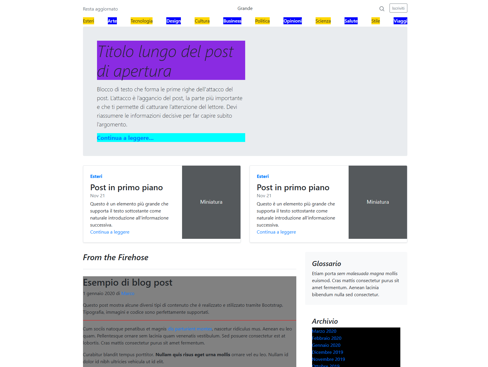

# Bootstrap Blog Template Clone

<p align="center">
  <a href="https://github.com/EmanWeBdV/EPICODE_M3-W1D1">
    
  </a>
</p>

<p align="center">
  A responsive <strong>blog / magazine-style webpage</strong> built with HTML, CSS and JavaScript.<br/>
  Focus on layout structure, typography, article sections and Bootstrap-based composition.<br/>
  <strong>This project was created during Module M3 of the Epicode course.</strong>
</p>

<p align="center">
  <a href="https://github.com/EmanWeBdV/EPICODE_M3-W1D1">
    
  </a>
  <a href="https://github.com/EmanWeBdV/EPICODE_M3-W1D1/issues">
    
  </a>
  <a href="#">
    
  </a>
</p>

<p align="center">
  <a href="#-preview">Preview</a>
  ·
  <a href="#-demo">Demo</a>
  ·
  <a href="https://github.com/EmanWeBdV/EPICODE_M3-W1D1/issues">Report a bug</a>
  ·
  <a href="https://github.com/EmanWeBdV/EPICODE_M3-W1D1/issues">Request a feature</a>
</p>

---

## ✨ Preview

<p align="center">
  
</p>

---

## 🔗 Demo

- **Live demo:** https://EmanWeBdV.github.io/EPICODE_M3-W1D1/

---

## 🧭 Table of Contents

- [Preview](#-preview)
- [Demo](#-demo)
- [Features](#-features)
- [Tech Stack](#-tech-stack)
- [Project Structure](#-project-structure)
- [Installation](#-installation)
- [Usage](#-usage)
- [Responsiveness](#-responsiveness)
- [Roadmap](#-roadmap)
- [Author](#-author)
- [License](#-license)
- [Disclaimer](#-disclaimer)

---

## 🚀 Features

- **Blog-style Header**
  - Top utility area with actions like _Search_ and _Subscribe_
  - Horizontal category navigation
  - Editorial / magazine-inspired structure

- **Hero Post Section**
  - Large featured opening post
  - Introductory text block
  - Call-to-action link to continue reading

- **Featured Posts**
  - Highlighted cards for secondary content
  - Category labels
  - Date, short description and read-more links

- **Main Article Area**
  - Full blog post layout with:
    - headings and subheadings
    - paragraphs
    - blockquotes
    - lists
    - code block example

- **Sidebar Content**
  - Glossary section
  - Archive section
  - External/social links section

- **Footer Navigation**
  - Credits section
  - “Back to top” link

- **Educational Context**
  - Built as a frontend exercise to practice Bootstrap layouts, typography hierarchy and multi-section page composition

---

## 🧱 Tech Stack

<p align="left">
  
  
  
  
</p>

---

## 📂 Project Structure

```bash
.
├── index.html
├── assets/
├── .gitignore
└── README.md
